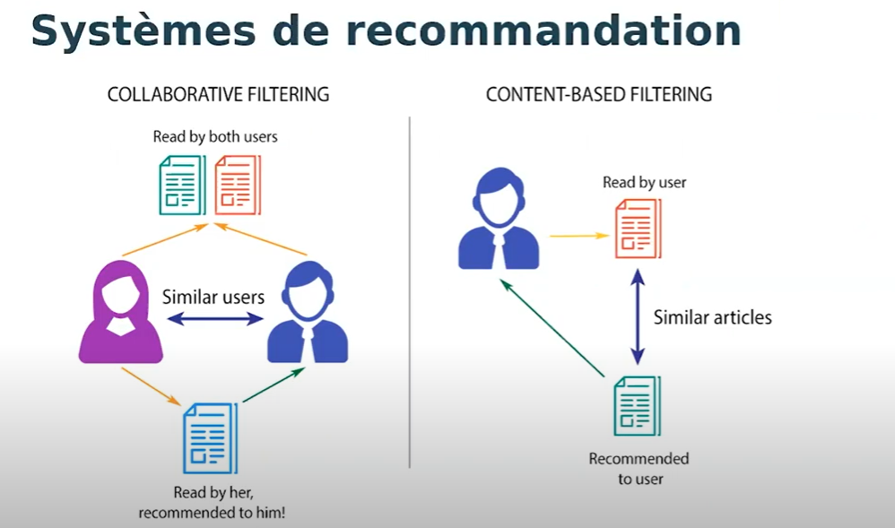
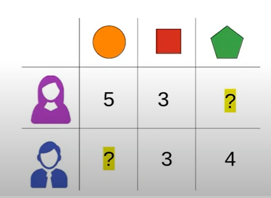

# Système de Recommandation

Construction des système de recommandation

## Généralité sur la recommandation

* Les systèmes de recommandation
* La recommandation par contenu
* Le filtrage collaboratif

## Système de recommandation 

* Ils sont partout (Netflix, Medium...)
* Ils fonctionnent grâce à differentes approches: 
   1. sur le contenu (content based RS)
   2. sur les métadonnées (content based RS)
   3. sur l'historique des utilisateurs (collaborative filtering)
* Ils sont parfois beaucoup plus basiques qu'imaginés

## Exemples

## Le Filtrage Collaboratif

* Approche in memory
* Approche par modèle
* Limites 
* Approches combinées et apports du Deep Learning

## Le Principe de Filtrage Collaboratif

* Un utilisateur x objet(s): (user x item)
* Nécessité d'un feedback utilisateur
  1. Explicite (note de 0 à 5)
  2. Implicite (click, achat, vue, like)
* Pas besoin d'autre données

## L'avantage de cette méthode

Son avantage c'est qu'on n'a pas de besoin d'information confidantielle sur l'utilisateur:
* l'âge
* le sexe
* confection religieuse
* ...
  
C'est ce que fait la pertinence de cette méthode car on n'a pas ces informations alors qu'elle donne des résultats impressionnants.

## Approche en mémoire

* User-item
  Pour l'utilisateur **Laby**, trouver tous les utilisateurs qui ont des acheter des produits similaires et recommander les objets que ces utilisateurs ont aimé. 

* Item-item
  Pour le produit **ordinateur portable Acer**, trouver tous les **utilisateurs** ayant **commander** cet objet, et trouver tous les autres objets ayant été **commander** par ces **utilisateurs**.